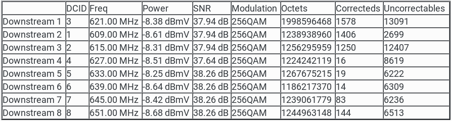
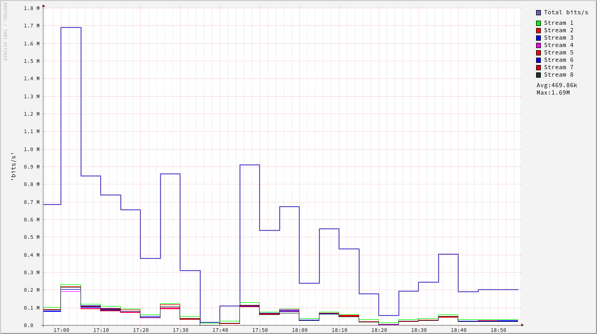

# Poor man's cable modem monitor

Monitor an **Arris cable modem** bandwidth usage from its status page. It's intended for those CMs that do not support SNMP out of the box but still offer the down stream octets count. It could be thought of as a router bandwidth usage monitor used.

If you are interested on monitoring a cable modem or router from another vendor (Netgear , etc.), please [create an issue](https://github.com/mluis7/cable_modem_stats/issues/new/choose) mentioning its model and attach the status page HTML source as a file. 

Based on Arris TG862 model.

**Table of Contents**

* [Description](#description)
  * [How to use scripts](#how-to-use-scripts)
* [How it works](#how-it-works)
  * [Parsing values](#parsing-values)
  * [RRDTool data source](#rrdtool-data-source)
  * [Inserting data points](#inserting-data-points)
  * [Creating a graph](#creating-a-graph)
* [Scripts help](#scripts-help)
  * [arris_stats.sh](#arris_statssh)
  * [create_data_source.sh](#create_data_sourcesh)
  * [current_stats.sh](#current_statssh)
    
## Description
Typically, status page is found at http://192.168.100.1/cgi-bin/status_cgi

We are interested in the ___Octets___ column of the ***Downstream*** table. It holds the count of octets or bytes per stream and could be used to calculate to downstream bandwidth in use during a period of time.



Solution will be based on standard Linux tools like `bash`, [xmllint](http://xmlsoft.org/xmllint.html) for HTML parsing with XPath and [rrdtool](https://oss.oetiker.ch/rrdtool/) a round robin database for time series data.

Other (possibly) supported models: 
CM550A, CM820A, TG852G, TG862G, TM402G, TM402P, TM502G, TM504G, TM508A, TM602G, TM604G, TM608G, TM702G, TM722G, TM822G, WBM760.

## How to use scripts
1) Create data source, see help for more options.

    `create_data_source.sh`

2) Create a cron job to run the update script, for example, every 5 minutes.

    ```bash
    */5 * * * * $HOME/bin/arris_stats.sh >> $HOME/tmp/arris-stats.log 2>&1
    ```

After some time there should be enough data to create a graphic showing downstream usage in bits/s

    ```bash
    current_stats.sh -d "$HOME/bin/arris-download.rrd" -s "8 hours ago" -o ~/tmp/myrouter-000.png
    ```

## How it works
### Parsing values
Values are obtained parsing the html with `xmllint`and the following XPath for each row. In the example below, row 2, column 7 holds the first value.

	```xml
	"//tbody[tr[td[.='DCID']]]/tr[2]/td[7]/text()"
	```

### rrdtool data source
Let's create the data source specifying the start time in Unix Epoch time. The type of the data source is set to DERIVE instead of COUNTER to avoid the spike in the graphic in case the router is restarted.

```bash
rrdtool create TG862A-downstream.rrd --start 1525303000 \
    DS:stream1:DERIVE:600:U:U \
    DS:stream2:DERIVE:600:U:U \
    DS:stream3:DERIVE:600:U:U \
    DS:stream4:DERIVE:600:U:U \
    DS:stream5:DERIVE:600:U:U \
    DS:stream6:DERIVE:600:U:U \
    DS:stream7:DERIVE:600:U:U \
    DS:stream8:DERIVE:600:U:U \
    RRA:AVERAGE:0.5:1:600 \
    RRA:AVERAGE:0.5:6:700 \
    RRA:AVERAGE:0.5:24:775 \
    RRA:AVERAGE:0.5:288:797 \
    RRA:MAX:0.5:1:600 \
    RRA:MAX:0.5:6:700 \
    RRA:MAX:0.5:24:775 \
    RRA:MAX:0.5:288:797 \
```

### Inserting data points
Data is constructed as a semicolon separated string of current timestamp and 1 value per stream taken from the **Downstream** table.
`arris_stats.sh`script can be used to insert values every 10 minutes with a cron job.

```bash
rrdtool update TG862A-downstream.rrd '1525656902:2028507401:1261128031:1283119650:1250781607:1292426630:1207561542:1264223879:1268794455'
```
**Cron job**
```bash
*/5 * * * * $HOME/bin/arris_stats.sh >> $HOME/tmp/arris-stats.log 2>&1
```

### Creating a graph
The command below will create a graph with down stream speed in `bits/s` for 2 hours worth of data between 12:00 and 13:00 of current date. Colors, legends, etc. can be modified on `current_stats.sh script.`

 


```bash
rfile="$HOME/bin/TG862A-downstream.rrd"
ofile="$HOME/tmp/tg862a-2h.png"
trange1="$(date -d '12:00' '+%s')"
trange2="$(date -d '13:00' '+%s')"
topt="--start $trange1 --end $trange2"
opts="--width=900 --height=600 --base=1000 --vertical-label='bits/s' --legend-position=east --interlaced"
rrdtool graph "$ofile" $opts $topt \
    DEF:in1=$rfile:stream1:AVERAGE \
    DEF:in2=$rfile:stream2:AVERAGE \
    DEF:in3=$rfile:stream3:AVERAGE \
    DEF:in4=$rfile:stream4:AVERAGE \
    DEF:in5=$rfile:stream5:AVERAGE \
    DEF:in6=$rfile:stream6:AVERAGE \
    DEF:in7=$rfile:stream7:AVERAGE \
    DEF:in8=$rfile:stream8:AVERAGE \
    CDEF:TotalIn=in1,in2,in3,in4,in5,in6,in7,in8,+,+,+,+,+,+,+,8,* \
    LINE2:TotalIn#6a5acd:"Total bits/s\n" \
    COMMENT:"\s" \
    CDEF:in1b=in1,8,* \
    CDEF:in2b=in2,8,* \
    CDEF:in3b=in3,8,* \
    CDEF:in4b=in4,8,* \
    CDEF:in5b=in5,8,* \
    CDEF:in6b=in6,8,* \
    CDEF:in7b=in7,8,* \
    CDEF:in8b=in8,8,* \
    LINE1:in1b#00FF00:"Stream 1\n" \
    LINE1:in2b#FF0000:"Stream 2\n" \
    LINE1:in3b#0000FF:"Stream 3\n" \
    LINE1:in4b#FF00FF:"Stream 4\n" \
    LINE1:in5b#EF0000:"Stream 5\n" \
    LINE1:in6b#0000EF:"Stream 6\n" \
    LINE1:in7b#DF0000:"Stream 7\n" \
    LINE1:in8b#1C3135:"Stream 8\n" \
    COMMENT:"\s" \
    GPRINT:TotalIn:AVERAGE:"Avg\:%4.2lf%s\n" \
    GPRINT:TotalIn:MAX:"Max\:%4.2lf%s\n" \
```

## Scripts help
### arris_stats.sh
    SUMMARY:
        Parse Arris cable modem status page using XPath and store results on rrd. Based on model TG862A status page.
    
    OPTIONS:
            -d Data source file path. Optional, /home/luis/tmp/arris-downstream.rrd by default.
            -u status page URL, default: http://192.168.100.1/cgi-bin/status_cgi
            -h This help.

### create_data_source.sh

    SUMMARY:
        Create rrdtool data source.
    
    Usage: 
        `create_data_source.sh -d <rrd filename> [-s <start time as Unix Epoch>] [-i]`
    
    Examples: 
        
```bash
            create_data_source.sh -d /home/luis/bin/arris-downstream.rrd -s 1525998621
```

### current_stats.sh

    SUMMARY:
        Create down stream speed graphic for the given time range, last 24 hs by default.
    Usage: 
    
```bash
         current_stats.sh [-d <data source file>] [-s <start time>] [-e <end time>] [-o <output image path>]
```
    
    Examples: 
        
```bash
        current_stats.sh -d /home/luis/bin/arris-download.rrd -s '14:00' -e '23:00' -o /home/luis/tmp/myrouter-000.png
        current_stats.sh -d /home/luis/bin/TG862G-download.rrd -s '14:00' -o /home/luis/tmp/myrouter-000.png
```
